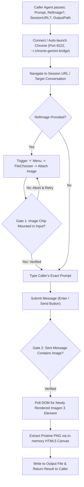

# Gemini Web Browser Image Generation Bridge | Gemini Web 浏览器自动化生图通道

[English Documentation](#english-specification) | [中文说明文档](#chinese-specification)

---

<a name="english-specification"></a>
## 🇬🇧 English Specification

### Purpose & Architecture
`gemini-web-image-gen` is a **pure browser automation bridge and execution channel**. It connects AI agents, test harnesses, and automated scripts to Google Gemini Web (Imagen 3) via the Chrome DevTools Protocol (CDP).

It does **NOT** enforce or modify prompts—prompts are treated as transparent strings passed directly from the calling agent. Its sole responsibility is providing a rock-solid, zero-cost browser execution channel that handles session persistence, file attachment uploads, dual-gated verification, and lossless canvas extraction.

### Core Responsibilities
1. **Chrome Session & Profile Management**:
   - Auto-discovers and connects to port 9222.
   - Automatically spawns a dedicated browser profile (`~/.chrome-gemini-bridge`) if Chrome is not running, preserving Google login credentials permanently.
2. **Transparent Prompt & Session Forwarding**:
   - Accepts any caller-provided prompt without alteration.
   - Reuses existing conversation URLs (`--url <chat_url>`) for multi-turn session continuity or opens fresh threads on demand.
3. **Dual-Gated Image Attachment Pipeline (for Img2Img)**:
   - **Gate 1 (Pre-Send Assertion)**: Triggers the CDK upload menu and asserts that Angular's input container has mounted the image thumbnail card before typing or sending. Aborts immediately on failure to prevent plain-text fallback.
   - **Gate 2 (Post-Send Assertion)**: Audits the DOM message bubble to confirm the reference image was received by the server.
4. **Lossless Canvas Extraction**:
   - Intercepts newly rendered `` elements in the DOM and draws them onto an in-memory HTML5 Canvas (`canvas.toDataURL('image/png')`), bypassing all CORS and temporary Blob URL restrictions to output full-resolution PNG files.

### Execution Flow


### CLI Usage (Universal Pass-Through)
```bash
# 1. Text-to-Image (T2I)
node "<skill_path>/scripts/generate_single.js" \
  --prompt "<your_prompt_string>" \
  --out "output/image.png"

# 2. Image-to-Image (I2I in Persistent Session)
node "<skill_path>/scripts/generate_single.js" \
  --url "https://gemini.google.com/app/<session_id>" \
  --ref "path/to/reference.png" \
  --prompt "<your_continuation_prompt>" \
  --out "output/result.png"
```

### Programmatic API Reference (Node.js)
```javascript
const { generateImage } = require('./scripts/gemini_bridge.js');

const result = await generateImage(promptString, {
  referenceImagePath: './ref.png',   // Optional: path to reference image
  targetUrl: 'https://gemini...',    // Optional: session URL for conversation reuse
  outputPath: './output.png',        // Destination PNG path
  timeoutMs: 90000                   // Optional: timeout in ms (default 90s)
});

// Result Object:
// {
//   success: true,
//   buffer: Buffer,
//   width: 1024,
//   height: 1024,
//   outputPath: './output.png',
//   durationMs: 14200
// }
```

---

<a name="chinese-specification"></a>
## 🇨🇳 中文说明文档

### 定位与架构设计
`gemini-web-image-gen` 是一个**纯粹的浏览器自动化生图通道与驱动底座**。它通过 Chrome DevTools Protocol (CDP) 为各种 AI Agent、自动化测试 Harness 及开发脚本提供稳定、免 API Key 的 Gemini Web (Imagen 3) 生图能力。

本技能**不包含任何特定业务的提示词工程**（不同项目与需求的提示词由调用方 Agent 自行决定）。本技能专注于构建高可靠的“输入通道”与“输出提取通道”，解决登录态保持、文件上传门禁、会话复用以及图片无损提取等底层工程问题。

### 核心功能与技术保障
1. **Chrome 会话与 Profile 独立托管**：
   - 自动探针 `http://127.0.0.1:9222` 远程调试端口；
   - 掉线或未启动时，自动以独立 Profile（`~/.chrome-gemini-bridge`）拉起 Chrome，一次登录永久保持登录态。
2. **纯粹透明的提示词与会话透传**：
   - 100% 透传调用方传入的 Prompt 文本，不做任何多余拼接或改写；
   - 支持传入已有会话链接（`--url <chat_url>`），在同一对话中保持多轮生图上下文与连续性。
3. **双重门禁质检机制 (Dual-Gated Assertion)**：
   - **Gate 1（发送前门禁）**：触发上传菜单后，硬性检测 Angular 输入容器是否已切实渲染出图片附件卡片（Attachment Chip）。若未检测到附件，立即阻断抛错，**绝对杜绝因上传未完成导致的“纯文本盲发降级”**；
   - **Gate 2（发送后门禁）**：消息发出后自动审计用户消息气泡，确保服务端切实接收到了图片。
4. **原生 Canvas Base64 无损提取**：
   - 绕过 Chrome 对临时 Blob URL 的跨域访问限制与防盗链机制，直接利用 `HTML5 Canvas.toDataURL('image/png')` 从 DOM 提取全分辨率原始 PNG 数据流落盘。

### 命令行调用 (CLI)
```bash
# 1. 基础生图
node "<skill_path>/scripts/generate_single.js" \
  --prompt "你的任意提示词" \
  --out "output/target.png"

# 2. 图生图（指定会话与参考图）
node "<skill_path>/scripts/generate_single.js" \
  --url "https://gemini.google.com/app/<session_id>" \
  --ref "path/to/reference.png" \
  --prompt "基于参考图的接续提示词" \
  --out "output/result.png"
```
